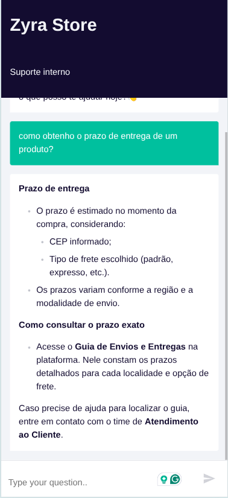
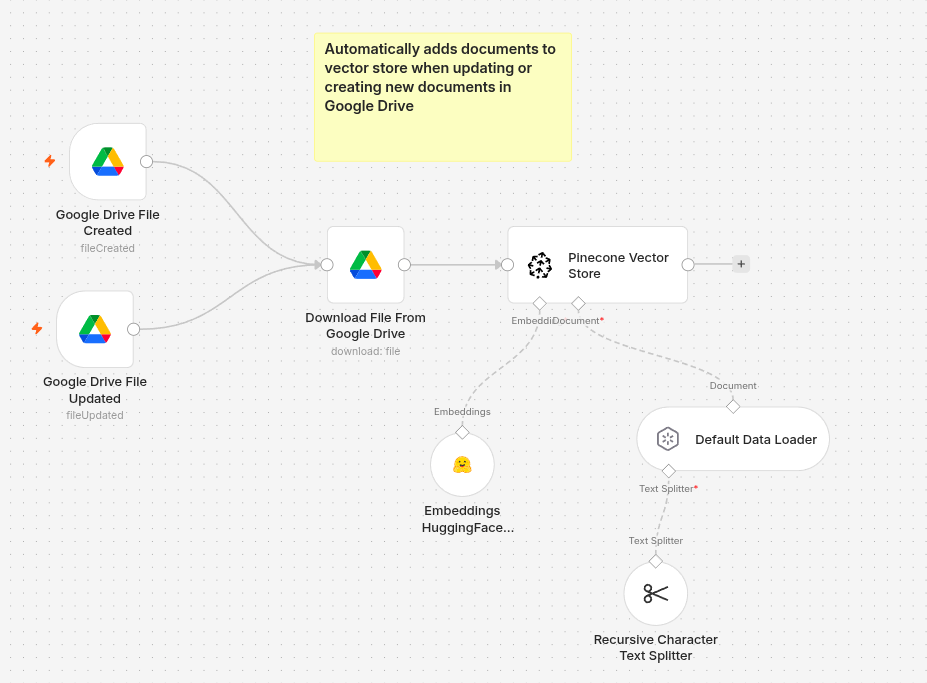
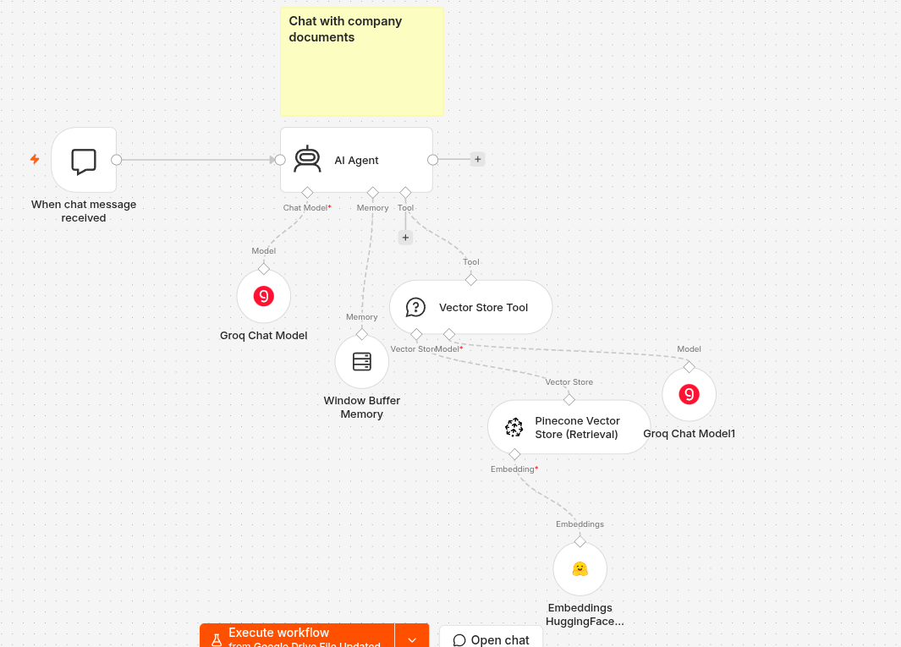
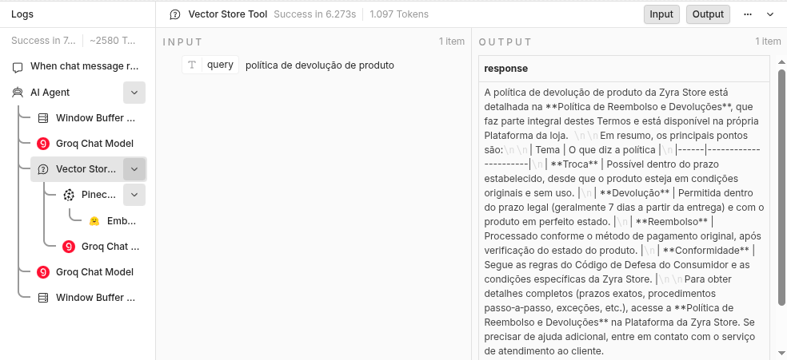

# Agente Interno de Suporte ao Funcionário da Loja Zyra Store
# RAG Chatbot para Documentos da Empresa (Google Drive + Pinecone + Groq)

Chatbot interno de documentação que responde perguntas de colaboradores com base exclusivamente nos documentos da empresa armazenados no Google Drive. Construído em [n8n](https://n8n.io), usando busca semântica (RAG) com Pinecone e modelos da Groq.

## Acesso à aplicação

O chat pode ser acessado publicamente em:

```
https://147-15-93-34.sslip.io/webhook/5f1c0c82-0ff9-40c7-9e2e-b1a96ffe24cd/chat
```



## Demonstração em vídeo
 
[](https://youtu.be/T0eXHyEOfvc)

## Como funciona

O fluxo é dividido em duas partes:

**1. Indexação (ingestão de documentos)**
Monitora uma pasta específica do Google Drive. Sempre que um arquivo é criado ou atualizado, o fluxo baixa o documento, converte formatos nativos do Google (Docs, Sheets, Slides) para PDF, quebra o conteúdo em chunks, gera embeddings e indexa no Pinecone.



**2. Consulta (chat)**
Um agente de IA recebe a pergunta do usuário via interface de chat, decide se precisa consultar os documentos (usando uma ferramenta de busca vetorial conectada ao Pinecone) e responde com base apenas no que foi recuperado, nunca inventando informação.




## Arquitetura




```
Google Drive (pasta monitorada)
        │
        ▼
Download File From Google Drive
        │
        ▼
Recursive Character Text Splitter → Default Data Loader
        │
        ▼
Embeddings (HuggingFace) → Pinecone Vector Store (index: company-files-v2)


When chat message received
        │
        ▼
      AI Agent (Groq: openai/gpt-oss-20b)
        │
        ├── Window Buffer Memory (últimas 4 mensagens)
        └── Vector Store Tool → Pinecone Vector Store (Retrieval)
                                        │
                                Embeddings (HuggingFace)
```

## Stack

| Componente | Serviço usado |
|---|---|
| Orquestração | n8n (self-hosted, Docker) |
| Modelo de linguagem | Groq — `openai/gpt-oss-20b` |
| Embeddings | HuggingFace Inference — `sentence-transformers/paraphrase-multilingual-mpnet-base-v2` (768 dimensões) |
| Banco vetorial | Pinecone (index `company-files-v2`, cosine, 768 dim) |
| Fonte dos documentos | Google Drive (pasta monitorada) |
| Hospedagem | Oracle Cloud Infrastructure (VM, Always Free ou trial) |
| Proxy reverso / SSL | Caddy (certificado automático via Let's Encrypt) |

## Pré-requisitos para construção

- Conta n8n self-hosted rodando (ver seção de deploy abaixo)
- Conta Groq com API key
- Conta Pinecone com um index criado (768 dimensões, métrica cosine)
- Conta HuggingFace com API key (Inference API)
- Projeto no Google Cloud Console com OAuth configurado para acesso ao Google Drive

## Deploy (Oracle Cloud Infrastructure)

Resumo dos passos usados para subir esse fluxo em produção:

1. Criar uma instância de Compute na OCI (Ubuntu 22.04), com IP público atribuído
2. Liberar as portas 22, 80 e 443 na Security List da VCN (Ingress, `0.0.0.0/0`)
3. Liberar as mesmas portas no firewall interno do Ubuntu (`ufw`)
4. Instalar Docker e Docker Compose na VM
5. Usar um domínio próprio ou um endereço gratuito via [sslip.io](https://sslip.io) (ex: `SEU-IP-COM-TRACOS.sslip.io`)
6. Subir o n8n com Docker Compose, usando Caddy como proxy reverso para gerar SSL automaticamente
7. Acessar a URL pública, criar o usuário admin e importar este fluxo

Variáveis de ambiente principais do n8n:

```
N8N_HOST=<seu-dominio-ou-sslip>
N8N_PROTOCOL=https
WEBHOOK_URL=https://<seu-dominio-ou-sslip>/
N8N_ENCRYPTION_KEY=<chave fixa gerada com openssl rand -hex 24>
GENERIC_TIMEZONE=America/Recife
```

## Configuração após importar o fluxo

1. Reconecte as 4 credenciais (Groq, Pinecone, HuggingFace, Google Drive), elas não vêm no export por segurança
2. No Google Cloud Console, adicione a nova Redirect URI do OAuth (`https://SEU-DOMINIO/rest/oauth2-credential/callback`) sem remover a antiga
3. Confirme que os dois nodes de embeddings (indexação e busca) usam exatamente o mesmo modelo — modelos diferentes ou dimensões diferentes quebram a busca
4. Ative o workflow

## Limitações conhecidas

- **Arquivos `.xlsx` enviados diretamente ao Drive não são indexados.** A conversão automática para PDF só funciona em Planilhas Google nativas. Para indexar uma planilha, abra o arquivo com "Google Planilhas" e salve como formato nativo antes de subir para a pasta monitorada.
- O modelo de embeddings atual (`paraphrase-multilingual-mpnet-base-v2`) foi escolhido por não exigir prefixos especiais de query/passage, ao contrário de modelos da família E5.

## Otimização de custo (tokens)

- O modelo usado no Agent principal e na ferramenta de busca é o mesmo (`gpt-oss-20b`), com teto de tokens de saída definido (500 no Agent, 300 na ferramenta)
- A memória de conversa está limitada às últimas 4 mensagens (`contextWindowLength`)
- O `System Message` do Agent é direto e evita repetição de instruções

## Troubleshooting

| Sintoma | Causa provável | Solução |
|---|---|---|
| Agent responde "não sei" sem tentar buscar | System Message não instrui o uso obrigatório da ferramenta | Adicionar instrução explícita mandando sempre chamar `documentos_empresa` antes de responder |
| `Vector dimension X does not match the dimension of the index Y` | Os dois nodes de embeddings (indexação e busca) usam modelos diferentes | Garantir que ambos usem o mesmo `modelName` |
| `text.replace is not a function` no Vector Store Tool | Incompatibilidade de parsing entre o modelo e o node, comum em versões antigas do n8n | Atualizar o n8n/pacote `@n8n/n8n-nodes-langchain`; reforçar no Description do tool que a entrada deve ser texto puro |
| Resposta busca conteúdo do tópico errado | Metadados ausentes nos chunks, ou modelo de embeddings incompatível com o tipo de busca | Adicionar metadado `source_document`; confirmar modelo de embeddings adequado |
| `redirect_uri_mismatch` ao conectar Google Drive | URL do n8n mudou (local → produção) e não foi cadastrada no OAuth Client | Adicionar a nova Redirect URI no Google Cloud Console |
| `Permission denied (publickey)` via SSH | Chave privada em formato antigo (PEM RSA) não suportado pela versão do OpenSSH, ou par de chaves incorreto | Converter com `ssh-keygen -p -f chave.key -N ""`; confirmar que está usando o par de chaves correto |

## Licença

Uso interno.

## Exemplos de uso
 
**Exemplos de perguntas que o agente consegue responder:**
 
- Qual é a política de reembolso e devoluções da empresa?
- Quais são os preços atuais da tabela de produtos?
- Como funciona o processo de solicitação de férias?
- Quais documentos são necessários para reembolso de despesas?
- Qual o prazo de resposta do suporte técnico interno?
**Exemplos de respostas geradas pelo agente:**
 
> **Pergunta:** Qual é a política de reembolso e devoluções da empresa?
> **Resposta:** De acordo com a Política de Reembolso e Devoluções, o cliente tem até 7 dias corridos após o recebimento para solicitar a devolução, desde que o produto esteja sem uso e na embalagem original. O reembolso é processado em até 10 dias úteis após a confirmação do recebimento do produto devolvido.
 
> **Pergunta:** Vocês têm política de trabalho remoto às sextas-feiras?
> **Resposta:** Não encontrei essa informação nos documentos disponíveis. Recomendo procurar o time de RH para confirmar essa política.
